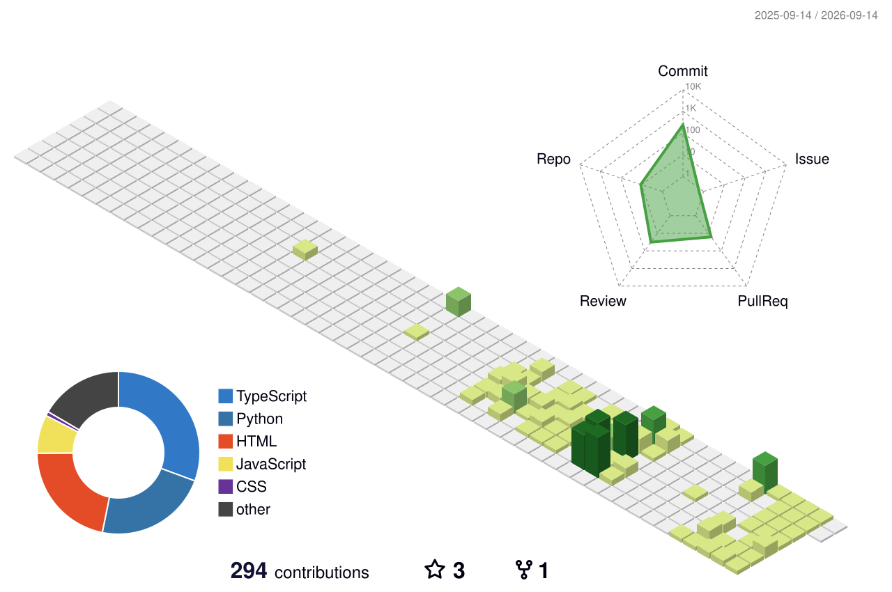

<h2 style="font-family: 'Arial', sans-serif;">👋 About Me</h2>

<table>
  <tr>
    <td>
      <strong>이름</strong>
    </td>
    <td>
      최준호
    </td>
  </tr>
  <tr>
    <td>
      <strong>생년월일</strong>
    </td>
    <td>
      1992.05.13
    </td>
  </tr>
  <tr>
    <td>
      <strong>전화번호</strong>
    </td>
    <td>
      010-7368-5337
    </td>
  </tr>
  <tr>
    <td>
      <strong>이메일</strong>
    </td>
    <td>
      chj0513a@gmail.com
    </td>
  </tr>
  <tr>
    <td>
      <strong>GitHub</strong>
    </td>
    <td>
      <a href="https://github.com/haracedaily/studyList">깃허브 학습코드</a>
    </td>
  </tr>
  <tr>
    <td>
      <strong>Notion</strong>
    </td>
    <td>
    <a href="https://ripe-potato-6b7.notion.site/17ccb7b25b6380238061d8af723d1fd7?pvs=4">학습과정</a>
     
    <a href="https://ripe-potato-6b7.notion.site/199cb7b25b63806cb824cac34c385531?v=199cb7b25b6380e4bb44000c5a535989&pvs=4">프로젝트</a>
        </td>
    </tr>
  <tr>
    <td>
      <strong>포트폴리오</strong>
    </td>
    <td>
      <a href="https://portfolio-silk-eight-20.vercel.app/">포트폴리오</a>
    </td>
  </tr>
</table>

<h2 style="font-family: 'Arial', sans-serif;">📌 Projects</h2>

**[NEXT — AI 기반 개발자 취업역량 진단 서비스](https://github.com/8teamNext)** | 

**[StarBus — 대구버스정보서비스](https://github.com/haracedaily/publicTraffic)** | 

**[IceCare — 청소기사vers](https://github.com/haracedaily/cleaning_node)** | 
**[IceCare — 관리자vers](https://github.com/haracedaily/ice_care_admin)** | 
**[IceCare — 클라이언트vers](https://github.com/haracedaily/renew_ice_clean)**

<h2 style="font-family: 'Arial', sans-serif;">💻 Tech Stack</h2>

<table>
  <tr><td><strong>FrontEnd</strong></td>
    <td>
      
      
      
      
      
      
      
      
      
      </td>
  </tr>
  <tr><td><strong>BackEnd</strong></td>
    <td>
      
      
      
      
      
      
      
      </td></tr>
  <tr><td><strong>Database</strong></td>
    <td>
      
      
      
      
      
    </td></tr>
  <tr><td><strong>IDE</strong></td>
  <td>
    
    
    
    
  </td>
  </tr>
</table>

<h2 style="font-family: 'Arial', sans-serif;">⭐ GitHub Top Lang</h2>

<h2 style="font-family: 'Arial', sans-serif;">⭐ GitHub Grass</h2>

---

<!--
## Hi there 👋
**haracedaily/haracedaily** is a ✨ _special_ ✨ repository because its `README.md` (this file) appears on your GitHub profile.

Here are some ideas to get you started:

- 🔭 I’m currently working on ...
- 🌱 I’m currently learning ...
- 👯 I’m looking to collaborate on ...
- 🤔 I’m looking for help with ...
- 💬 Ask me about ...
- 📫 How to reach me: ...
- 😄 Pronouns: ...
- ⚡ Fun fact: ...
-->
